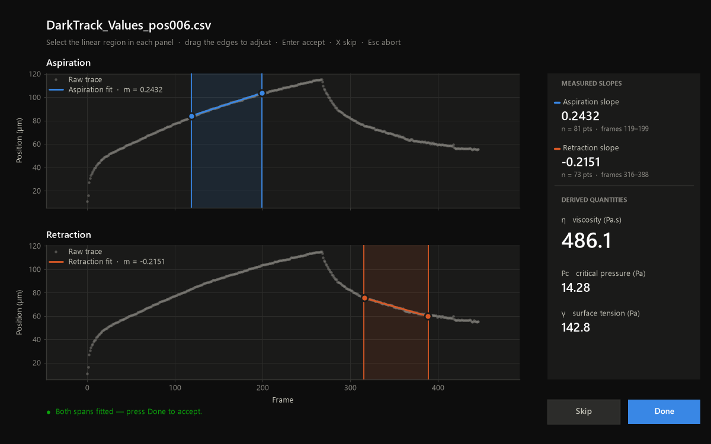

# Pipette Viscometry (`pipette-viscometry`)

[](https://www.python.org/downloads/)
[](https://opensource.org/licenses/MIT)

An interactive, config-driven Python package for micropipette aspiration viscosity measurement data analysis.


It is a decoupled numerical architecture, an interactive dual-span Matplotlib GUI with live-updating parameter calculations, non-silent metadata parsing, and atomic, append-safe CSV storage to measure directly the mechanical parameters of creep release pipette experimental kymograph segmented csvs.


---

## Key Features

- **Interactive Span Selection GUI (`pipette-fit`)**:
  - Dual-panel Matplotlib interface for selecting aspiration and retraction linear slopes.
  - Live side panel rendering real-time linear fits and calculated physical parameters ($\eta$, $P_c$, $\gamma$) as selection spans are adjusted.
  - Skip (`x`) and Abort (`Esc`) shortcuts to bypass bad fits or terminate batches safely.
- **Decoupled & Testable Core**:
  - Pure-function numerical physics (`physics.py`) and span fitting (`fitting.py`) decoupled from Matplotlib rendering.
  - Full headless unit test coverage for array slicing, zero-division guards, and unit conversion math.
- **YAML Configuration**:
  - Centralized experiment metadata, default aspiration pressures ($P$), pipette radii ($R_p$, $R_{cac}$), and IO pathing.
- **Metadata Parsing & Overrides**:
  - Regular expression parser for experimental log files (`PipInfo.txt`).
  - Secondary CSV mapping override (`series_map.csv`) to cleanly include or exclude individual series (e.g., test or control runs).
- **Atomic Persistence**:
  - Per-file incremental append to target CSV results files to prevent data loss on mid-run interruptions.

---

## Installation & Setup

### Prerequisites
- Python `>= 3.10` (Tested on Python `3.13`)
- [Pixi](https://pixi.sh/) (Recommended) or `pip`

### Using Pixi (Recommended)

1. Clone the repository:
   ```bash
   git clone https://github.com/your-org/pipette-viscometry.git #to be updated on release
   cd pipette-viscometry 
   ```

2. Install dependencies and setup the environment after pixi is installed in your system:
   ```bash
   pixi install
   ```

3. Run tests to verify setup:
   ```bash
   pixi run test
   ```

### Using Standard Pip

```bash
pip install -e .[dev]
```

---

## Directory & Package Architecture

```text
pipette_viscometry/
├── pyproject.toml               # Package build configuration (Hatchling)
├── pixi.toml                    # Pixi environment & task definitions
├── config/
│   └── example_config.yaml      # Master experiment configuration schema
├── src/pipette_viscometry/
│   ├── __init__.py
│   ├── config.py                # YAML schema parsing & validation
│   ├── physics.py               # Pure parameter calculations (eta, Pc, gamma)
│   ├── fitting.py               # Pure span-fitting & slicing logic
│   ├── io.py                    # CSV reader (header fix) and atomic append writer
│   ├── metadata.py              # Log regex parser & series override mapper
│   ├── gui.py                   # Matplotlib widgets, live panel, & event handlers
│   └── cli.py                   # CLI entry point (pipette-fit)
└── tests/
    ├── test_physics.py
    ├── test_fitting.py
    ├── test_io.py
    ├── test_metadata.py
    └── test_config.py
```

---

## Configuration (`config.yaml`)

All parameters and file paths are defined in a single YAML configuration file:

```yaml
experiment:
  name: "Pipetteing_zebrafish"
  date: "2023-04-19"
  metadata_txt: "./data/PipInfo.txt"        # Optional log file
  series_map_csv: "./data/series_map.csv"   # Optional series mapping override

instrument:
  Rp: 20.0           # pipette inner radius (um)
  Rcac: 367          # Embryo radius of curvature (um)
  P_default: 500.0   # applied aspiration pressure (Pa)


paths:
  input_dir: "./data"
  input_glob: "*Values*.csv"
  output_file: "./results/ViscoResults_19042023.csv"
  append: true

gui:
  live_display: true
  skip_hotkey: "x"
  escape_hotkey: "escape"

fitting:
  min_points: 3
```

---

## Usage

### 0. Fiji macros

Example Fiji/ImageJ macros used in the image-processing workflow are available in [`src/pipette_viscometry/fiji-macro/`](src/pipette_viscometry/fiji-macro/).

The included macros provide image-processing and profile-analysis utilities. They do not currently export the CSV curve files consumed by `pipette-fit`; running the [kymograph macro](src/pipette_viscometry/fiji-macro/Plot_Kymograph_Profile.ijm) allows you to choose to save the generated data and can be modified to save the CSVs as desired.


### 1. Execute Analysis CLI

To start analyzing a directory of CSV curves:

```bash
# Using Pixi
pixi run fit --config config/config.yaml

# Using standard Python terminal
pipette-fit --config config/config.yaml
```
The config yaml file is runnable example using bundled test data in the tests folder for this project. Please adapt it for your experiment before use. 

Omit `--config` to pick the YAML file from a graphical file browser instead:

```bash
pixi run pipette-fit
```

Cancelling the dialog exits without processing anything.

### 2. Interactive GUI Shortcuts

| Action | Control / Key | Description |
| :--- | :--- | :--- |
| **Select Aspiration Span** | Drag mouse on Top Axis | Drag horizontal selector over aspiration phase |
| **Select Retraction Span** | Drag mouse on Bottom Axis | Drag horizontal selector over retraction phase |
| **Confirm Fit** | Click **Done** | Save current fit and advance to next curve |
| **Skip Curve** | Click **Skip** or Press `x` | Write `skipped=True` and `NaN` metrics; advance to next curve |
| **Abort Run** | Press `Esc` | Safely terminate execution loop |

---

## Outputs & Data Schema

Results are written incrementally to the configured `output_file` CSV path:

This schema allows you to precisely asses where to fit and what outputs can be gained from a curve. 


| Column | Description |
| :--- | :--- |
| `embryo_id` | Mapped embryo ID (e.g., `E1`, `E2`) from metadata or series map |
| `series` | Numeric series index parsed from filename |
| `filename` | Raw input CSV filename |
| `date` / `time` | Timestamp from metadata |
| `P`, `Rp`, `Rcac` | Experimental constants used for calculations |
| `lasp`, `lret` | Fitted linear slopes for aspiration and retraction spans |
| `eta` | Effective dynamic viscosity ($\eta$) |
| `Pc` | Critical entry pressure ($P_c$) |
| `gamma` | Surface tension ($\gamma$) |
| `skipped` | Boolean flag (`True` if user skipped bad curve) |
| `notes` | Verbatim log entry notes from `PipInfo.txt` |

---

## Running Unit Tests

```bash
# Run full suite
pixi run test

# Run via pytest directly
pytest
```

---

## License

Distributed under the MIT License. See `LICENSE` for more details.
